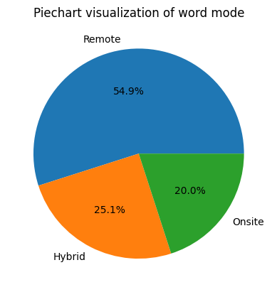
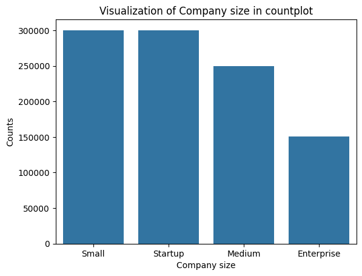

# Data analysis and Feature engineering on Fake intership posting 

#### About dataset: 
This dataset presents a large-scale synthetic simulation of internship and job postings designed to model realistic recruitment behavior, phishing tactics, suspicious hiring patterns, and fraudulent employment activities across multiple industries.

The dataset combines company verification signals, recruiter behavior, compensation patterns, NLP-inspired scam indicators, and trust-related features to create realistic fraud detection scenarios suitable for machine learning, cybersecurity analytics, exploratory data analysis (EDA), and business intelligence projects.

Data source:https://www.kaggle.com/datasets/aiexplorer77/internship-scam-detection-dataset

### Basic overview of dataset:
+ 1M dataset with 33 columns:
+ Columns:'posting_date', 'internship_title', 'employment_type', 'work_mode',
       'industry', 'location', 'company_name', 'company_size', 'company_age',
       'linkedin_presence', 'website_available', 'domain_age_months',
       'verification_status', 'stipend', 'unrealistic_salary_flag',
       'payment_required', 'registration_fee', 'job_description_length',
       'grammatical_errors', 'vague_description_score', 'urgency_score',
       'keyword_spam_score', 'fake_certificate_offer',
       'recruiter_experience_years', 'recruiter_email_type',
       'suspicious_email_domain', 'recruiter_response_time_hours',
       'social_media_presence', 'emotional_manipulation_score',
       'phishing_language_score', 'trust_signal_score', 'fraud_score',
       'is_fake_posting

### Objectives:
+ The main objective of this data analysis is to finding the pattern related to fake intership of job posting.
+ To build the Machine learning model for fake intership posting.

## Univariant data analysis 

#### 1. Internship title:
+ For 9 different title internship post are made.
+ Maxium post is for marketing intern(111577).

#### Employment types:
+ Types of employment: Part-Time, Intership,Contract and full time.
+ Almost euqal number of post are made for each types of employement.
+ Part-Time(250700),Internship(249998),Contract     (249669),Full-Time(249633)

#### Work Mode:
+ Nearly 55 % of post are made for remote intern.
+ More then 25% post are made for Hybird and 20 % of post are made for Onsite. 

##### Visualization in Piechart:

  

#### Industry:
Intership post made for each industry.
AI               111803
EdTech           111417
Healthcare       111357
FinTech          111025
E-Commerce       111016
Marketing        111005
Gaming           110967
Cybersecurity    110878
Software         110532

#### Location:
Location of company
Sydney           111520
Toronto          111477
Bangalore        111441
San Francisco    111390
Berlin           110990
Dubai            110987
Singapore        110882
London           110754
New York         110559

#### Company size:
+ Maximum number of post are made by startup and small company 

##### Data visualization in countplot:

  

#### Company Age:
Number of years since company establishment.
+ On average the age of company is 20.
+ 1%(10000) data are missing.

#### Linkedin Presence
+ 80% of company have presence in linkedin.

#### Website available:
+ Around 85% company have website.

#### Domain age in months:
+ Average:239.
+ Max:500.
+ Min:1.

#### Varification status:
+ Around 70% post are varfied 

#### Stipend:
+ On average 35066 
+ Max: 110428
+ Min: 2000

#### Unrealistic salary flag:
+ There is no any unrealistic salary flag in dataset

#### Payment requirement:
+ 90% post for intership require no payment.

#### Registration fee:
+ 90% internship doesn't are for registration fee.
+ in 10% , 4999 is the maximum charge for registration fee.

#### Job description lenght:
Average: 1799
Max:5000
Min: 100

#### Grammatical Errors:
+ On average 2 grammatical error are found in internship post.
+ Max:14
+ Min:0

#### Vague Description score:
Average: 30
Max: 100
Min:0
+ More than 7% dataset has zero score i.e 73938.

#### Urgency Score:
Average: 40
Max:100
Min:0
+ Nearly 6% dataset has zero score i.e 59153.

#### Keyword spam score:
Average:25
Max:100
Min: 0
+ More than 11% dataset has zero score i.e 114428.

#### Fake certification score:
+ 92% post say no fake certification score.

#### Recruiter Experience year:
Average: 5
Min:0 
Max:19
+ Nearly 5% dataset has zero experience i.e 49615.

#### Recruiter email type:
+ 75% mail for recruiter is corporator.
+ 25% mail is free.

#### Suspicious Email domain:
+ 25% email domain are suspicious.

#### Recruiter response time(in hours):
Average: 18
Min:1
Max:63
+ Nearly 5% recruiter response in less then 1 hour.

#### Social media presence:
+ 75% dataset say there is the presence in social media.

#### Emotional manipulation score:
Average: 25
Min:0
Max: 100
+ 11.5% dataset score 0 in emotional manipulation score.

#### Phishing language score:
Average: 20
Min:0
Max:100

+ 14.5 dataset score is 0 in Phishing language score.

#### Trust singal score:
Average:56
Min:0
Max:100

#### Fraud Score:
Average:34
Min:0
Max:100
+ 5% dataset score is 0 in fraud score.

#### Is fake posting:
+ Around 78% post are not fake and 22% post are fake..