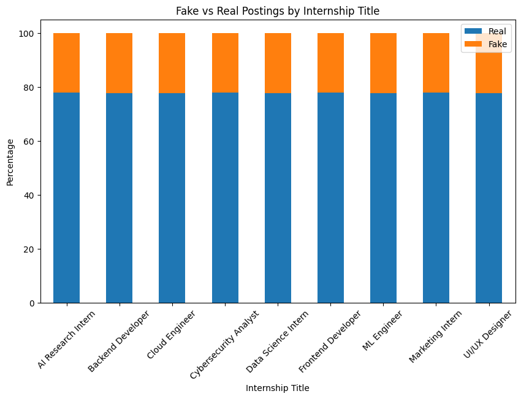
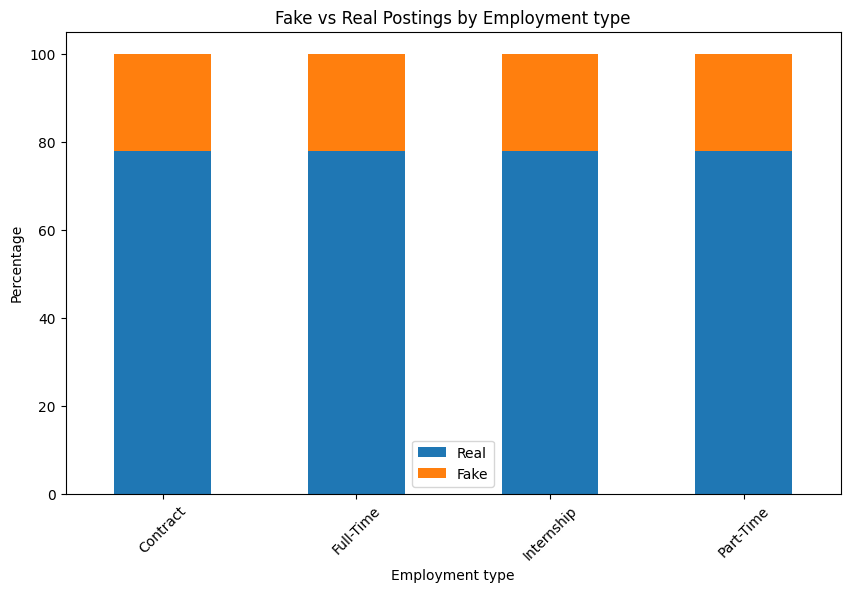
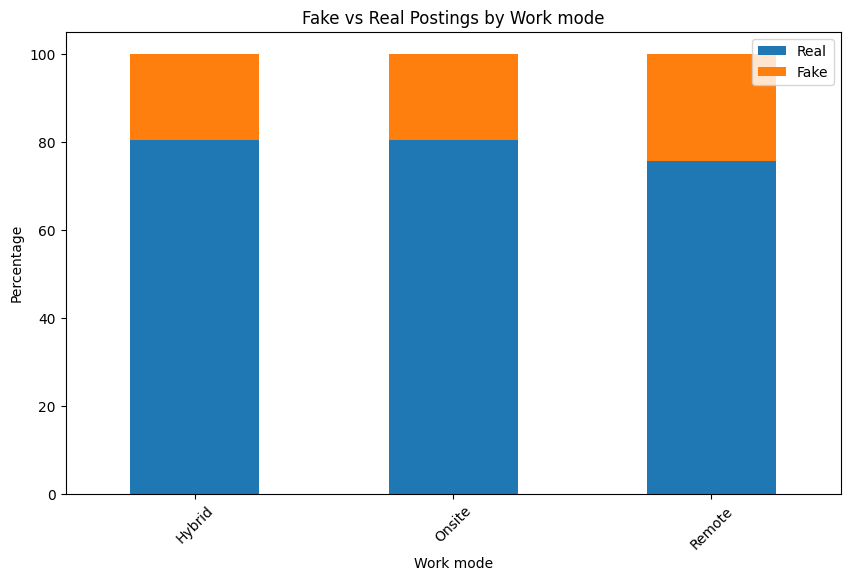

# Data analysis and Feature engineering on Fake intership posting 

#### About dataset: 
This dataset presents a large-scale synthetic simulation of internship and job postings designed to model realistic recruitment behavior, phishing tactics, suspicious hiring patterns, and fraudulent employment activities across multiple industries.

The dataset combines company verification signals, recruiter behavior, compensation patterns, NLP-inspired scam indicators, and trust-related features to create realistic fraud detection scenarios suitable for machine learning, cybersecurity analytics, exploratory data analysis (EDA), and business intelligence projects.

Data source:https://www.kaggle.com/datasets/aiexplorer77/internship-scam-detection-dataset

### Basic overview of dataset:
+ 1M dataset with 33 columns:
+ Columns:'posting_date', 'internship_title', 'employment_type', 'work_mode',
       'industry', 'location', 'company_name', 'company_size', 'company_age',
       'linkedin_presence', 'website_available', 'domain_age_months',
       'verification_status', 'stipend', 'unrealistic_salary_flag',
       'payment_required', 'registration_fee', 'job_description_length',
       'grammatical_errors', 'vague_description_score', 'urgency_score',
       'keyword_spam_score', 'fake_certificate_offer',
       'recruiter_experience_years', 'recruiter_email_type',
       'suspicious_email_domain', 'recruiter_response_time_hours',
       'social_media_presence', 'emotional_manipulation_score',
       'phishing_language_score', 'trust_signal_score', 'fraud_score',
       'is_fake_posting

### Objectives:
+ The main objective of this data analysis is to finding the pattern related to fake intership of job posting.
+ To identify most impactful features for fake posting.
+ To build the Machine learning model for fake intership posting.

## Univariant data analysis 

#### 1. Internship title:
Title of the internship or job role
+ For 9 different title internship post are made.
+ Maxium post is for marketing intern(111577).

#### Employment types:
Type of employment (Internship, Full-Time, Part-Time, Contract)
+ Types of employment: Part-Time, Intership,Contract and full time.
+ Almost euqal number of post are made for each types of employement.
+ Part-Time(250700),Internship(249998),Contract     (249669),Full-Time(249633)

#### Work Mode:
Work arrangement type (Remote, Hybrid, Onsite)
+ Nearly 55 % of post are made for remote intern.
+ More then 25% post are made for Hybird and 20 % of post are made for Onsite. 

##### Visualization in Piechart:

  

#### Industry:
Industry sector associated with the posting.
+ Intership post made for each industry.
+ AI               111803
+ EdTech           111417
+ Healthcare       111357
+ FinTech          111025
+ E-Commerce       111016
+ Marketing        111005
+ Gaming           110967
+ Cybersecurity    110878
+ Software         110532

#### Location:
Geographic location of the opportunity.
+ Location of company
+ Sydney           111520
+ Toronto          111477
+ Bangalore        111441
+ San Francisco    111390
+ Berlin           110990
+ Dubai            110987
+ Singapore        110882
+ London           110754
+ New York         110559

#### Company size:
Estimated organization size category.
+ Maximum number of post are made by startup and small company 

##### Data visualization in countplot:

  

#### Company Age:
Number of years since company establishment.
+ On average the age of company is 20.
+ 1%(10000) data are missing.

#### Linkedin Presence:
Indicates whether the company has a LinkedIn presence.
+ 80% of company have presence in linkedin.

#### Website available:
Indicates whether the company has an official website.
+ Around 85% company have website.

#### Domain age in months:
Estimated website domain age in months.
+ Average:239.
+ Max:500.
+ Min:1.

#### Varification status:
Simulated company verification status
+ Around 70% post are varfied 

#### Stipend:
Offered salary or internship stipend amount.
+ On average 35066 
+ Max: 110428
+ Min: 2000

#### Unrealistic salary flag:
Indicates unusually high or suspicious compensation offers.
+ There is no any unrealistic salary flag in dataset

#### Payment requirement:
Indicates whether applicants are asked to make a payment.
+ 90% post for intership require no payment.

#### Registration fee:
Simulated registration or onboarding fee amount.
+ 90% internship doesn't are for registration fee.
+ in 10% , 4999 is the maximum charge for registration fee.

#### Job description lenght:
Length of the job description text.
+ Average: 1799
+ Max:5000
+ Min: 100

#### Grammatical Errors:
Estimated number of grammatical issues detected in the posting.
+ On average 2 grammatical error are found in internship post.
+ Max:14
+ Min:0

#### Vague Description score:
Measures how unclear or vague the job description is.
+ Average: 30
+ Max: 100
+ Min:0
+ More than 7% dataset has zero score i.e 73938.

#### Urgency Score:
Simulated urgency or pressure level used in the posting.
+ Average: 40
+ Max:100
+ Min:0
+ Nearly 6% dataset has zero score i.e 59153.

#### Keyword spam score:
Indicates suspicious or spam-like keyword usage intensity.
+ Average:25
+ Max:100
+ Min: 0
+ More than 11% dataset has zero score i.e 114428.

#### Fake certification score:
Indicates whether fake certification incentives are offered.
+ 92% post say no fake certification score.

#### Recruiter Experience year:
Estimated recruiter experience in years.
+ Average: 5
+ Min:0 
+ Max:19
+ Nearly 5% dataset has zero experience i.e 49615.

#### Recruiter email type:
Type of recruiter email domain (Corporate or Free).
+ 75% mail for recruiter is corporator.
+ 25% mail is free.

#### Suspicious Email domain:
Indicates suspicious email provider usage (0 = No, 1 = Yes).
+ 25% email domain are suspicious.

#### Recruiter response time(in hours):
Estimated recruiter response time in hours.
+ Average: 18
+ Min:1
+ Max:63
+ Nearly 5% recruiter response in less then 1 hour.

#### Social media presence:
Indicates recruiter social media visibility (0 = No, 1 = Yes).
+ 75% dataset say there is the presence in social media.

#### Emotional manipulation score:
Simulated emotional persuasion intensity in the posting.
+ Average: 25
+ Min:0
Max: 100
+ 11.5% dataset score 0 in emotional manipulation score.

#### Phishing language score:
Measures phishing or scam-related language patterns.
+ Average: 20
+ Min:0
+ Max:100

+ 14.5 dataset score is 0 in Phishing language score.

#### Trust singal score:
Overall trustworthiness score of the posting and company.
+ Average:56
+ Min:0
+ Max:100

#### Fraud Score:
Aggregated fraud likelihood score generated from multiple suspicious indicators.
+ Average:34
+ Min:0
+ Max:100
+ 5% dataset score is 0 in fraud score.

#### Is fake posting:
Target label indicating whether the posting is fraudulent.
+ Around 78% post are not fake and 22% post are fake.

## Bivariate Analysis

Target column: is_fake_posting
+ Analysing the relationship between target columns and all inputs features.

### Categorical columns vs target column

#### Intership title and target column:
**Insight**:The state for fake post and real post for all internship title is identical.

| Internship Title      | Real Postings (%) | Fake Postings (%) |
|----------------------|------------------:|------------------:|
| AI Research Intern   | 77.90             | 22.10             |
| Backend Developer    | 77.72             | 22.28             |
| Cloud Engineer       | 77.72             | 22.28             |
| Cybersecurity Analyst| 77.89             | 22.11             |
| Data Science Intern  | 77.66             | 22.34             |
| Frontend Developer   | 78.00             | 22.00             |
| ML Engineer          | 77.68             | 22.32             |
| Marketing Intern     | 77.87             | 22.13             |
| UI/UX Designer       | 77.79             | 22.21             |

##### Data visualization in Bargraph:

  

**Conclusion**: We can conclude that internship title doesn't appear a strong features to identify the fake post and real post. So we can remove from the dataset during the feature engineering.

#### Employment type and target column:
**Insight**:For each employment type real post and fake post  percentage is similar.

| Employment Type | Real Postings (%) | Fake Postings (%) |
|----------------|------------------:|------------------:|
| Contract       | 77.87             | 22.13             |
| Full-Time      | 77.77             | 22.23             |
| Internship     | 77.81             | 22.19             |
| Part-Time      | 77.77             | 22.23             |

##### Data visualization in Bargraph:

  

**Conclusion**: We can conclude that Employment type doesn't appear a strong features to identify the fake post and real post.  So we can remove from the dataset during the feature engineering.

#### Work mode and target column:
**Insight**: The number of fake post for the remote work is hingher then any other work mode. When a work mode is remote real posting percentage is drop to 75.59% and fake post raise up to 24.41%.

| Work Mode | Real Postings (%) | Fake Postings (%) |
|-----------|------------------:|------------------:|
| Hybrid    | 80.55             | 19.45             |
| Onsite    | 80.43             | 19.57             |
| Remote    | 75.59             | 24.41             |

##### Data visualization in Bargraph:

  

**Conclusion**: We can conclude that work mode has a few impact on indentifying the real or fake post. Because when the work mode is remote then it make few change in real and fake post for internship or job.  So we can remove from the dataset during the feature engineering.

#### Industry and target column:
**Insight**: The percentage of real amd fake post for all types of industry remain similar.

| Industry      | Real Postings (%) | Fake Postings (%) |
|---------------|------------------:|------------------:|
| AI            | 77.75             | 22.25             |
| Cybersecurity | 77.79             | 22.21             |
| E-Commerce    | 77.90             | 22.10             |
| EdTech        | 77.80             | 22.20             |
| FinTech       | 77.66             | 22.34             |
| Gaming        | 77.88             | 22.12             |
| Healthcare    | 77.77             | 22.23             |
| Marketing     | 77.85             | 22.15             |
| Software      | 77.83             | 22.17             |

**Conclusion**: We can conclude that industry column doesn't make any impact on indentifying the real or fake post. 

#### Location and target column:
**Insight**: The percentage of real and fake post remains similar for all location in the range between 77% to 78% for real post and 21% to 22% for fake post.
+ | Location      | Real Postings (%) | Fake Postings (%) |
|--------------|------------------:|------------------:|
| Bangalore     | 77.43             | 22.57             |
| Berlin        | 77.79             | 22.21             |
| Dubai         | 77.75             | 22.25             |
| London        | 77.90             | 22.10             |
| New York      | 77.80             | 22.20             |
| San Francisco | 77.80             | 22.20             |
| Singapore     | 77.78             | 22.22             |
| Sydney        | 77.92             | 22.08             |
| Toronto       | 78.08             | 21.92             |

**Conclusion**: We can conclude that location feautes doesn't appear as a strong features to identify the real or fake post. So we can remove from the dataset during the feature engineering.

#### Company size and target column:

**Insight:** The fake posting rate is almost identical across all company sizes (~22%). This suggests that `company_size` has very weak predictive power for detecting fraudulent job postings.

| Company Size | Real Postings (%) | Fake Postings (%) |
|--------------|------------------:|------------------:|
| Enterprise   | 77.81             | 22.19             |
| Medium       | 77.90             | 22.10             |
| Small        | 77.76             | 22.24             |
| Startup      | 77.76             | 22.24             |

**Conclusion**: We can conclude that company size also doesn't appear as a strong features to seperate the fake or real post.So we can remove from the dataset during the feature engineering.

#### Linkedin presence and target column:
**Insight:** LinkedIn presence shows a strong relationship with fraud detection. Companies without a LinkedIn presence have a much higher fake posting rate (39.43%) compared to those with LinkedIn presence (17.91%). This makes `linkedin_presence` one of the most important predictive features in this dataset.

| LinkedIn Presence | Real Postings (%) | Fake Postings (%) |
|-------------------|------------------:|------------------:|
| 0 (No)           | 60.57             | 39.43             |
| 1 (Yes)          | 82.09             | 17.91             |

**Conclusion**: We can conclude that linkedin presence features if the impactful features to identify the fake or real post.

#### Website available and target column:

**Insight:** Website availability is a strong indicator of job authenticity. Companies without a website have a much higher fake posting rate (40.90%) compared to companies with a website (18.88%). This suggests that `website_available` is an important feature for detecting fraudulent job postings.

| Website Available | Real Postings (%) | Fake Postings (%) |
|-------------------|------------------:|------------------:|
| 0 (No)           | 59.10             | 40.90             |
| 1 (Yes)          | 81.12             | 18.88             |

**Conclusion**: We can conclude that website available is also the strong features to identify the real or fake post.

#### Verification status and target column:
**Insight**:Verification status shows a mild relationship with fraud detection. Verified companies have a slightly lower fake posting rate (21.06%) compared to non-verified ones (24.85%).
| Verification Status | Real Postings (%) | Fake Postings (%) |
| ------------------- | ----------------: | ----------------: |
| 0 (Not Verified)    |             75.15 |             24.85 |
| 1 (Verified)        |             78.94 |             21.06 |

**Insight:** We can conclude that verification status is has slightly impact on seperating the fake or real post.

#### Payment required and target column:
**Insight:** Payment requirement is a very strong indicator of fraudulent job postings. When payment is required, the fake posting rate rises dramatically to 68.87%, compared to only 17.02% when no payment is required. This makes `payment_required` one of the strongest predictive features in the dataset.

| Payment Required | Real Postings (%) | Fake Postings (%) |
|------------------|------------------:|------------------:|
| 0 (No)          | 82.98             | 17.02             |
| 1 (Yes)         | 31.13             | 68.87             |

**Conclusion:** So we can conclude that Payment requirement features could be the one of the strongest features for fake post detection.

#### Fake certificate offer and target column:
**Insight:** Fake certificate offers are a strong indicator of fraudulent job postings. When a certificate is offered, the fake posting rate increases significantly to 51.27%, compared to only 19.67% when no certificate is offered. This makes `fake_certificate_offer` a highly predictive feature for fraud detection.

| Fake Certificate Offer | Real Postings (%) | Fake Postings (%) |
|------------------------|------------------:|------------------:|
| 0 (No)                | 80.33             | 19.67             |
| 1 (Yes)               | 48.73             | 51.27             |
**Conclusion:** So we can conclude that Fake Certificate Offer features could be the one of the strongest features for fake post detection.

#### Recruiter emial type and target column:

**Insight:** Recruiter email type is a strong indicator of job authenticity. Corporate email domains are associated with a much lower fake posting rate (16.91%), while free email domains show a significantly higher fake posting rate (37.99%). This makes `recruiter_email_type` an important feature for fraud detection.

| Recruiter Email Type | Real Postings (%) | Fake Postings (%) |
|----------------------|------------------:|------------------:|
| Corporate           | 83.09             | 16.91             |
| Free                | 62.01             | 37.99             |

**Conclusion:** So we can conclude that Recruiter Email Type features could be the one of the strongest features for fake post detection.

#### Social media presence and target column:
**Insight:** Social media presence does not show any meaningful relationship with job authenticity. The fake posting rate remains almost identical whether social media is present or not (~75%). This indicates that `social_media_presence` has little to no predictive power for fraud detection in this dataset.

| Social Media Presence | Real Postings (%) | Fake Postings (%) |
|----------------------|------------------:|------------------:|
| 0 (No)              | 24.98             | 75.02             |
| 1 (Yes)             | 25.14             | 74.86             |

**Conclusion**: We can conclude that social media presence does not have huge impact on seperating the fake or real post so we can remove this features.

#### Suspicious email domain and target column:
**Insight:** Suspicious email domains are strongly associated with fraudulent job postings. When a suspicious email domain is used, the fake posting rate increases to 37.99%, compared to only 16.91% for non-suspicious domains. This makes `suspicious_email_domain` a strong predictive feature for fraud detection.

| Suspicious Email Domain | Real Postings (%) | Fake Postings (%) |
|------------------------|------------------:|------------------:|
| 0 (Not Suspicious)     | 83.09             | 16.91             |
| 1 (Suspicious)         | 62.01             | 37.99             |

**Conclusion:** So we can conclude that Suspicious email domain features could be the one of the strongest features for fake post detection.

## Numeric columns and target column

#### Company age and target column:

**Insight**: We can observe that there is slightly difference between the fake and real post in all quartile,mean and std.

| is_fake_posting | Count   | Mean      | Std       | Min | 25% | 50% | 75% | Max |
|-----------------|---------|-----------|-----------|-----|-----|-----|-----|-----|
| 0               | 770,242 | 20.178987 | 11.159887 | 1.0 | 11.0 | 20.0 | 30.0 | 39.0 |
| 1               | 219,758 | 19.373443 | 11.547607 | 1.0 | 9.0 | 19.0 | 29.0 | 39.0 |

**Conclusion**: The feature does not appear to strongly distinguish fake postings from real postings so we can remove this feature.

#### Domain age(in months) and target column:
**Insight**: We can observe that the stat of domain age column is slightly difference between the fake and real post in all quartile,mean and std.

| is_fake_posting | Count   | Mean      | Std       | Min | 25% | 50% | 75% | Max |
|-----------------|---------|-----------|-----------|-----|-----|-----|-----|-----|
| 0 (Real)        | 778,042 | 241.672063 | 134.636149 | 1.0 | 126.0 | 242.0 | 357.0 | 500.0 |
| 1 (Fake)        | 221,958 | 232.071806 | 139.274324 | 1.0 | 110.0 | 232.0 | 352.0 | 500.0 |

**Conclusion**: Real postings tend to have slightly higher values for this feature than fake postings. But we can't consider this features as a strong feature.

#### Stipend and target column:

**Insigth**: We can observe that the stat of Stipend column is slightly difference between the fake and real post in all quartile,mean and std.

| is_fake_posting | Count   | Mean       | Std        | Min    | 25%     | 50%      | 75%      | Max      |
|-----------------|---------|------------|------------|--------|----------|-----------|-----------|----------|
| 0 (Real)        | 770,238 | 35,072.26  | 14,823.21  | 2,000  | 24,857   | 34,988    | 45,121    | 110,428  |
| 1 (Fake)        | 219,762 | 35,044.95  | 14,854.04  | 2,000  | 24,794   | 34,966.5  | 45,145    | 98,828   |

**Conclusion**: We can conclude that stipend column also doesn't appear as a strong features. So we can remove it.

#### Registration fee and target column:
**Insight**: Fake postings have an average value almost 8 times larger than real postings.
| is_fake_posting | Count   | Mean      | Std       | Min | 25% | 50% | 75% | Max  |
|-----------------|---------|-----------|-----------|-----|-----|-----|------|------|
| 0 (Real)        | 778,042 | 100.72    | 570.52    | 0   | 0   | 0   | 0    | 4,999 |
| 1 (Fake)        | 221,958 | 782.67    | 1,413.44  | 0   | 0   | 0   | 1,005| 4,999 |

**Conclusion**: We can conclude that registration fee could be a slightly impactful feature of seperating fake or real post.

#### Job description lenght and target column:

**Insight**: The stat of real and fake post is almost identical.
| is_fake_posting | Count   | Mean      | Std      | Min  | 25%  | 50%  | 75%  | Max  |
|-----------------|---------|-----------|----------|------|------|------|------|------|
| 0 (Real)        | 778,042 | 1799.71   | 598.70   | 100  | 1394 | 1799 | 2203 | 5000 |
| 1 (Fake)        | 221,958 | 1798.95   | 598.09   | 100  | 1395 | 1799 | 2202 | 4521 |

**Conclusion**: We can conclude that job description column doesn't appear as a strong features. So we can remove it.

#### Grammatical Error and target column:
**Insight**: In grammatical column also the stat of real and fake post is similar
| is_fake_posting | Mean  | Median | Min | Max |
|-----------------|-------|--------|-----|-----|
| 0 (Real)        | 2.896 | 3.0    | 0   | 13  |
| 1 (Fake)        | 3.358 | 3.0    | 0   | 14  |

**Conclusion**: We can conclude that grammatical error doesn't make high impact on seperating the fake or real post.

#### Vague description score and target column:

**Insight**: We can see that stat of fake is higher then real post in vagure description column.

| is_fake_posting | Count   | Mean  | Std   | Min | 25% | 50% | 75% | Max |
|-----------------|---------|-------|-------|-----|-----|-----|-----|-----|
| 0 (Real)        | 778,042 | 27.69 | 18.01 | 0   | 14  | 27  | 40  | 100 |
| 1 (Fake)        | 221,958 | 38.69 | 19.05 | 0   | 26  | 39  | 52  | 100 |

**Conclusion**: The difference in stat of fake and real post make the features more impactful to seperate the fake or real post.

#### Urgency score and target column:
**Insight**: We can see that stat of fake is higher then real post in Urgency score column.
| is_fake_posting | Count   | Mean  | Std   | Min | 25% | 50% | 75% | Max |
|-----------------|---------|-------|-------|-----|-----|-----|-----|-----|
| 0 (Real)        | 778,042 | 38.26 | 23.24 | 0   | 21  | 38  | 54  | 100 |
| 1 (Fake)        | 221,958 | 46.31 | 23.83 | 0   | 29  | 46  | 63  | 100 |

**Conclusion**: The difference in stat of fake and real post make the features more impactful to seperate the fake or real post.

#### Keyword spam and target column:
**Insight**: We can see that stat of fake is higher then real post in Keyword spam column.

| is_fake_posting | Count   | Mean  | Std   | Min | 25% | 50% | 75% | Max |
|-----------------|---------|-------|-------|-----|-----|-----|-----|-----|
| 0 (Real)        | 778,042 | 24.51 | 17.80 | 0   | 10  | 23  | 37  | 100 |
| 1 (Fake)        | 221,958 | 29.31 | 18.72 | 0   | 15  | 29  | 42  | 100 |

**Conclusion**: The difference in stat of fake and real post make the features more impactful to seperate the fake or real post.

#### Recruiter experience year and target column:

**Insight**: The stat of real and fake post is almost identical for recruiter experience year column.
| is_fake_posting | Count   | Mean  | Std  | Min | 25% | 50% | 75% | Max |
|-----------------|---------|-------|------|-----|-----|-----|-----|-----|
| 0 (Real)        | 778,042 | 5.05  | 2.87 | 0   | 3   | 5   | 7   | 19.6 |
| 1 (Fake)        | 221,958 | 5.04  | 2.87 | 0   | 3   | 5   | 7   | 17.9 |

**Conclusion**: So we can conclude that this feature doesn't show any impact on seperating the real or fake post.

#### Recruiter response time and target column:
**Insight**: The stat of real and fake post is almost identical for Recruiter response time column.

| is_fake_posting | Count   | Mean  | Std  | Min | 25% | 50% | 75% | Max |
|-----------------|---------|-------|------|-----|-----|-----|-----|-----|
| 0 (Real)        | 778,042 | 18.18 | 9.61 | 1.0 | 11.2 | 18.0 | 24.8 | 63.9 |
| 1 (Fake)        | 221,958 | 18.19 | 9.60 | 1.0 | 11.3 | 18.0 | 24.7 | 63.5 |

**Conclusion**: We can conclude that recruiter response time doesn't have a huge impact on seperating fake and real post.So we can remove this features.

#### Emotional manipulation score and target column:

**Insight**: The stat of real and fake post is almost identical for Emotional manipulation score column.

| is_fake_posting | Count   | Mean  | Std   | Min | 25% | 50% | 75% | Max |
|-----------------|---------|-------|-------|-----|-----|-----|-----|-----|
| 0 (Real)        | 778,042 | 25.57 | 18.13 | 0   | 11  | 24  | 38  | 100 |
| 1 (Fake)        | 221,958 | 25.55 | 18.14 | 0   | 11  | 24  | 38  | 100 |

**Conclusion**: We can conclude that Emotional manipulation score doesn't have a huge impact on seperating fake and real post. So we can remove this features.

#### Phishing language score and target column:
**Insight**: The stat of fake post is higher then real post. So it shows that phishing language score could be a impactful features for seperating the fake or real post.
| is_fake_posting | Count   | Mean  | Std   | Min | 25% | 50% | 75% | Max |
|-----------------|---------|-------|-------|-----|-----|-----|-----|-----|
| 0 (Real)        | 778,042 | 18.39 | 14.81 | 0   | 5   | 17  | 29  | 100 |
| 1 (Fake)        | 221,958 | 29.03 | 16.72 | 0   | 17  | 29  | 41  | 100 |

**Conclusion**: We can conclude that phishing language score is the important feature for seperating the fake and real post.

#### Trust singal score and target column:

**Insight**: The state of real post is higher then fake post in trust signal score. Higher the trust signal more chance of real post.
| is_fake_posting | Count   | Mean  | Std   | Min | 25% | 50% | 75% | Max |
|-----------------|---------|-------|-------|-----|-----|-----|-----|-----|
| 0 (Real)        | 770,280 | 59.93 | 14.97 | 0   | 49.7 | 60.1 | 70.3 | 100 |
| 1 (Fake)        | 219,720 | 44.72 | 15.52 | 0   | 34.2 | 44.8 | 55.3 | 100 |

**Conclusion**: We can conclude that trust singal is the impactful features for seperating the real or fake post.

#### Fraud score and target column:
**Insight**: We can clearly see that average of fraud score for fake post is almost 2.5x larger then real post and also in every other stat fake post  fraud score is higher then real post in huge margin.

| is_fake_posting | Count   | Mean  | Std   | Min | 25% | 50% | 75% | Max |
|-----------------|---------|-------|-------|-----|-----|-----|-----|-----|
| 0 (Real)        | 778,042 | 25.29 | 14.24 | 0   | 14.4 | 26.2 | 37.0 | 50  |
| 1 (Fake)        | 221,958 | 64.57 | 12.12 | 50  | 55   | 61.4 | 71.1 | 100 |

**Conclusion**: So we can conclude that fraud score is the one of the strongest features for seperating the fake or real post.

